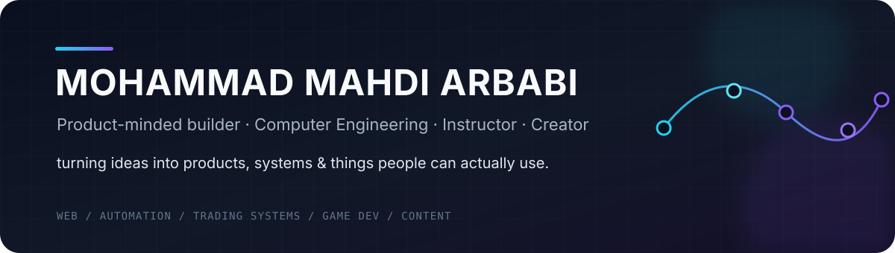
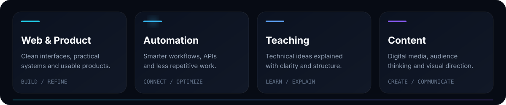

  

  

  
  
  

---

## About

I'm **Mohammad Mahdi Arbabi** — a Computer Engineering student, instructor, web developer, and content creator.

I enjoy working where **engineering, product thinking, automation, and communication** meet. I care about building things that are technically solid, visually clean, easy to use, and purposeful.

> **Can this be made faster, cleaner, smarter, or more useful?**

That question is usually where I start.

  

---

## Toolkit

  

  <code>Python</code> ·
  <code>FastAPI</code> ·
  <code>JavaScript</code> ·
  <code>PHP</code> ·
  <code>WordPress</code> ·
  <code>APIs</code> ·
  <code>Automation</code> ·
  <code>Git</code>

---

## Beyond code

Teaching and content creation are a big part of how I think about technology.

They've taught me to value **clarity, structure, attention to detail, and communication** just as much as implementation.

I also run **[Lyrica Ultra Funk](https://youtube.com/@lyricaultrafunk/)**, a YouTube music channel built around a distinct visual identity and high-energy content.

---

## What I care about

`Useful products` · `Clean UX` · `Automation` · `AI workflows` · `Web systems` · `Teaching` · `Digital media`

---

  
    Build clearly. Learn constantly. Make the next version better.
  

